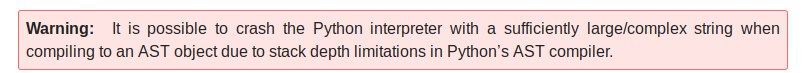

We are given a challenge server `misc.hsctf.com:8550` and a python [script](./data/repl.py)
```
$ cat repl.py
#!/usr/bin/env python3
with open("flag.txt") as flag: # open flag file
    flag = flag.read() # read contents of flag file
try: # make sure we don't run out of memory
    while 1: # do this forever
        try: # try to read a line of input
            line = input(">>> ") # prompt is python's standard prompt
        except EOFError: # user is done typing input
            print() # ensure there is a line-break
            break # exit from the loop
        else: # successfully read input
            try: # try to compile the input
                code = compile(line, "<input>", "exec") # compile the line of input
            except (OverflowError, SyntaxError, ValueError, TypeError, RecursionError) as e: # user input was bad
                print("there was an error in your code:", e) # notify the user of the error
            if False: exec(code) # run the code
            # TODO: find replacement for exec
            # TODO: exec is unsafe
except MemoryError: # we ran out of memory
    # uh oh
    # lets remove the flag to clear up some memory
    print(flag) # log the flag so it is not lost
    del flag # delete the flag
    # hopefully we have enough memory now
```
So, we have to cause `MemoryError` somehow to get access to flag. Looking at code closely, `exec(code)` statement never gets executed. So, the only two places where MemoryError can occur is either `line = input(">>> ")` or `code = compile(line, "<input>", "exec")`. Of the two options, latter one seems more plausible to look into.

Looking into the docs of builtin function compile, we found following.



So at first I tried generating large strings for AST but that was a dead end. I didn't understand properly what kind of `complex` strings to give as input?

Then, I went to cpython's github repository and searched for mentions of `MemoryError` in the codebase. Luckily, the number of results wasn't that large. I started scrolling past them one by one, and then one of them caught my attention.

Inside [test_parser.py](https://github.com/python/cpython/blob/8c77b8cb9188165a123f2512026e3629bf03dc9b/Lib/test/test_parser.py), I found following block of code
```
def test_trigger_memory_error(self):
    e = self._nested_expression(100)
    rc, out, err = assert_python_failure('-c', e)
    # parsing the expression will result in an error message
    # followed by a MemoryError (see #11963)
    self.assertIn(b's_push: parser stack overflow', err)
    self.assertIn(b'MemoryError', err)
```
Ah, a complex string might be a nested expression! Let's generate a large nested dictionary of nesting length 100.
```
python -c "print(''.join(['{\'test\':' for i in range(100)]))" | nc misc.hsctf.com 8550
>>> s_push: parser stack overflow
hsctf{dont_you_love_parsers}
```
